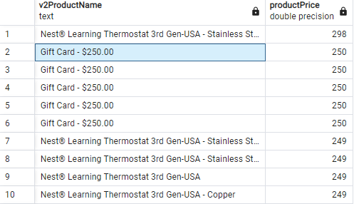
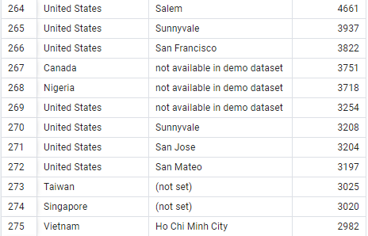

Question 1: what are the most expensive products?

SQL Queries: 
```
SELECT "v2ProductName", "productPrice" FROM all_sessions

ORDER BY "productPrice" DESC
```

Answer: 




Question 2: how many unique users?

SQL Queries:
```
SELECT COUNT(DISTINCT "fullVisitorId") FROM all_sessions
```
Answer:
14223


Question 3: countries that spend the most time browsing

SQL Queries: countries that spend the most time browsing
```
SELECT country, city, "timeOnsite" FROM all_sessions
GROUP BY country, city, "timeOnsite"
ORDER by "timeOnsite" DESC
```
Answer: 




Question 4: what is the price of the best selling item (LED ball point pens)? 

```
SELECT "v2ProductName", "productPrice" FROM all_sessions
GROUP by "v2ProductName","productPrice"
ORDER BY "productPrice" DESC
```


Answer: 2


Question 5: how much money do LED ball point pens generate?

SQL Queries:

```
SELECT "v2ProductName", sales.total_ordered AS total_ordered FROM all_sessions sessions
JOIN sales_report sales
ON sessions."productSKU" = sales."SKU"
ORDER BY "v2ProductName"
```

Answer: 
given we know the cost is 2 and that there is 36 orders of 456 worth of Ballpoint LED light pen 

32832
