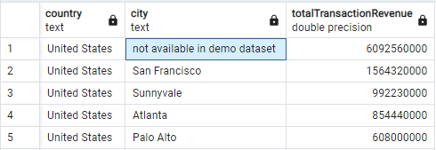
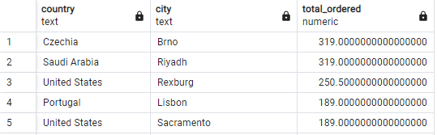
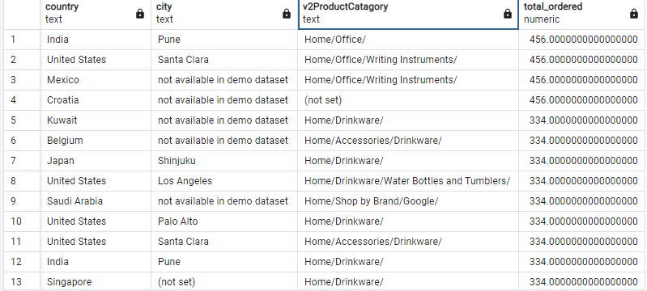
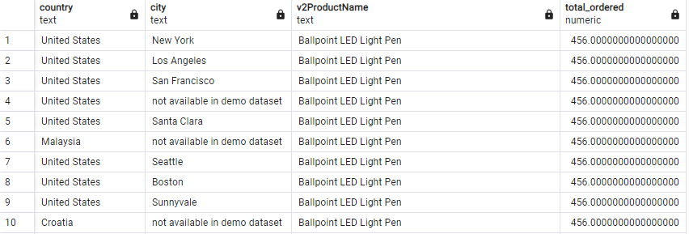
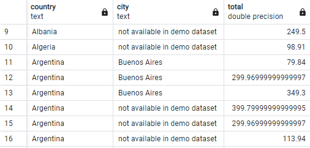

Answer the following questions and provide the SQL queries used to find the answer.

    
**Question 1: Which cities and countries have the highest level of transaction revenues on the site?**


SQL Queries:
```
SELECT "country", "city", sum("totalTransactionRevenue") as "totalTransactionRevenue" from all_sessions

WHERE "totalTransactionRevenue" IS NOT NULL

GROUP BY "country", "city"

ORDER BY "totalTransactionRevenue" DESC;
```

Answer:



The city with the highest level of transaction revenue is clearly USA as for the city with the highest transaction revenue, it gets abit less obvious, the *labeled* city with the most transaction revenue is San Francisco since the unlabeld cites are all added together under "not availiable  in demo dataset" there is potential that under that label there is a city with more transaction revenue


**Question 2: What is the average number of products ordered from visitors in each city and country?**


SQL Queries:
```
SELECT country, city, AVG(sales.total_ordered) AS total_ordered FROM all_sessions sessions
JOIN sales_report sales
ON sessions."productSKU" = sales."SKU"
group by sessions.country, sessions.city
ORDER BY total_ordered DESC; 
```

Answer:



The image shows the average total ordered from the top 5 counties with the highest average total ordereds


**Question 3: Is there any pattern in the types (product categories) of products ordered from visitors in each city and country?**


SQL Queries:
query 1
```
SELECT country, city, "v2ProductCatagory", AVG(sales.total_ordered) AS total_ordered FROM all_sessions sessions
JOIN sales_report sales
ON sessions."productSKU" = sales."SKU"
group by sessions.country, sessions.city, "v2ProductCatagory"
ORDER BY total_ordered DESC; 
```


Answer:

almost every country and city seems to share that home products always appear and dominates list of products catagories that have the most total ordered, following by office, writing instruments also appearing quite often as well


**Question 4: What is the top-selling product from each city/country? Can we find any pattern worthy of noting in the products sold?**


SQL Queries:
```
SELECT country, city, "v2ProductName", AVG(sales.total_ordered) AS total_ordered FROM all_sessions sessions
JOIN sales_report sales
ON sessions."productSKU" = sales."SKU"
group by sessions.country, sessions.city, "v2ProductName"
ORDER BY total_ordered DESC; 
```


Answer:


we can see ballpoint led light pens holds is the top selling product which is followed by waterbottles if you were to see the whole result instead of screen shot


**Question 5: Can we summarize the impact of revenue generated from each city/country?**

SQL Queries:
```
SELECT sessions.country, sessions.city, (sessions."productPrice" * sales.total_ordered) AS total FROM all_sessions sessions
JOIN sales_report sales
ON sessions."productSKU" = sales."SKU"
WHERE sales.total_ordered > 1
ORDER BY sessions.country, sessions.city
```


Answer:



Yes we see the revenue generated from each city


